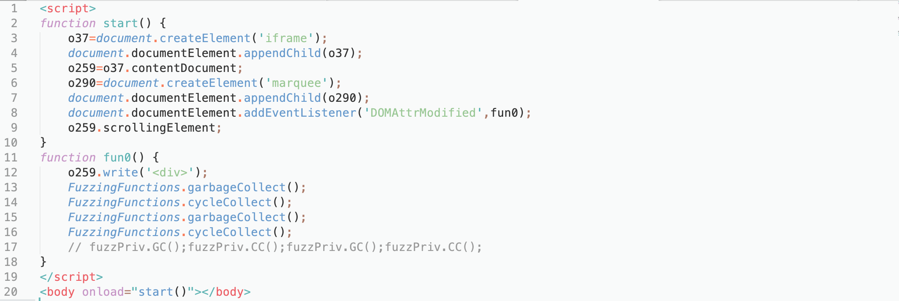
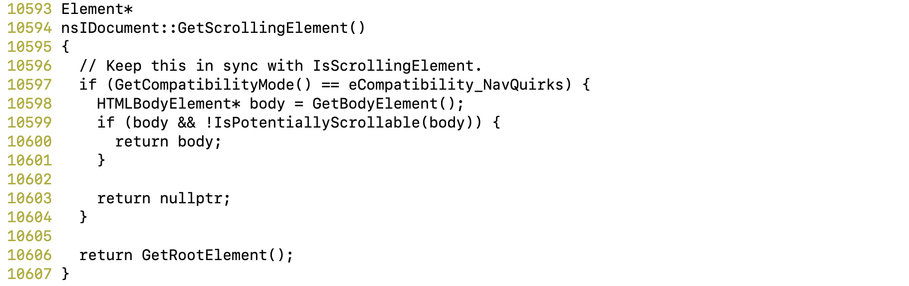
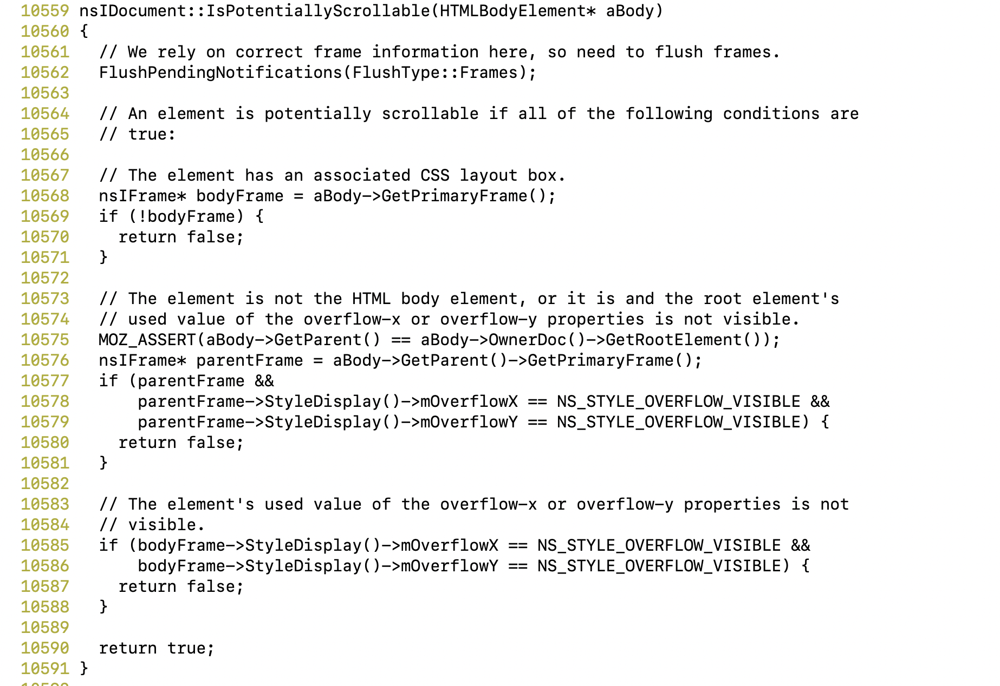

# CVE-2018-5100

## Description

A use-after-free vulnerability can occur when arguments passed to the "IsPotentiallyScrollable" function are freed while still in use by scripts. This results in a potentially exploitable crash. This vulnerability affects Firefox < 58.

## Firefox

I tested this vulnerability with Firefox 56.0 ASAN+Fuzzing build. The mozconfig I used is [here](https://github.com/ZihanYe/Firefox-Exploitation/blob/master/Manual%20Exploitation/CVE-2018-5100/mozconfig).

To build it, I had to downgrade my rust to 1.19.0 according to [Firefox's Rust Update policy](https://wiki.mozilla.org/Rust_Update_Policy_for_Firefox). To do that, install rustup and do ```rustup default 1.19.0```.

In order for making Firefox opening the PoC file without any other disruption, I used some customized preferences. Preferences can be set in ```about:config``` page in Firefox by searching for preferences listed in [user.js](https://github.com/ZihanYe/Firefox-Exploitation/blob/master/Manual%20Exploitation/CVE-2018-5100/user.js), or if you are running Firefox in headless mode (```--headless```), then create a new profile like this:

```
mkdir -p /path/to/firefox/build/directory/tmp/customized_profile
```
and move [user.js](https://github.com/ZihanYe/Firefox-Exploitation/blob/master/Manual%20Exploitation/CVE-2018-5100/user.js) under the new profile folder.

Run firefox with options ```--headless --no-remote --profile /path/to/the/profile/folder/just/created file:///path/to/crash.html```


## PoC

The original crash test uses ```FuzzPriv``` extention. However I did not managed to install it. Alternatively, we can use ```FuzzingFunctions``` interface implemented in fuzzing build of Firefox. So instead of triggering GC/CC using the extension, I used

```
FuzzingFunctions.garbageCollect();
FuzzingFunctions.cycleCollect();
```



The vulnerability is caused when inside a function ```IsPotentiallyScrollable```, an ```HTMLBodyElement``` is passed in but later freed because of the callback function being triggered.

## Where HTMLBodyElement is freed

In Line 9, getting scrollingElemnent leads to ```nsIDocument::GetScrollingElement()``` in :



It calls ```nsIDocument::IsPotentiallyScrollable```. The ```HTMLBodyElement``` passed in is the body element associated with ```o259``` in Javascript.

In ```nsIDocument::IsPotentiallyScrollable```:



```FlushPendingNotifications``` is called, in which the callback function ```fun0``` is triggered. In Line 12, writing to ```o259``` causes the old body element being overwritten. So the argument of ```FlushPendingNotifications``` is freed.

## Where the dangling pointer is dereferenced

When returning to ```FlushPendingNotifications``` after callback is executed. We get to Line 10568, which uses the dangling pointer (```aBody```)

ASAN reports a use-after-free with the following stack trace:

```
READ of size 4 at 0x60d00026a96c thread T0
    #0 0x7fdd5cbe34cc in nsINode::GetBoolFlag(nsINode::BooleanFlag) const /home/ug16zy2/firefox-56.0/dom/base/nsINode.h:1602:12
    #1 0x7fdd5cbe34cc in nsINode::IsInUncomposedDoc() const /home/ug16zy2/firefox-56.0/dom/base/nsINode.h:540
    #2 0x7fdd5cbe34cc in nsIContent::GetPrimaryFrame() const /home/ug16zy2/firefox-56.0/objdir-ff-asan/dist/include/nsIContent.h:911
    #3 0x7fdd5cbe34cc in mozilla::dom::Element::GetPrimaryFrame() const /home/ug16zy2/firefox-56.0/objdir-ff-asan/dist/include/mozilla/dom/Element.h:1196
    #4 0x7fdd5cbe34cc in nsIDocument::IsPotentiallyScrollable(mozilla::dom::HTMLBodyElement*) /home/ug16zy2/firefox-56.0/dom/base/nsDocument.cpp:10568
    #5 0x7fdd5cbe3873 in nsIDocument::GetScrollingElement() /home/ug16zy2/firefox-56.0/dom/base/nsDocument.cpp:10599:18
```


In a debug build: It ends up with a SIGSEGV:

```
Thread 1 "firefox" received signal SIGSEGV, Segmentation fault.
0x00007f68fb141449 in nsINode::GetBoolFlag (this=0x0, name=nsINode::IsInDocument)
    at /home/ug16zy2/firefox-56.0/dom/base/nsINode.h:1602
1602	    return mBoolFlags & (1 << name);
(gdb) info registers
rax            0x0	0
rbx            0x558429551e60	94026117488224
rcx            0x2	2
rdx            0x20008	131080
rsi            0x1	1
rdi            0x0	0
rbp            0x7ffdf0057cd0	0x7ffdf0057cd0
rsp            0x7ffdf0057cd0	0x7ffdf0057cd0
r8             0x8	8
r9             0x8	8
r10            0x5584295c37a0	94026117953440
r11            0x2	2
r12            0x7ffdf0058750	140728630347600
r13            0x558426a572b0	94026072421040
r14            0x7f68fa169ac4	140088849111748
r15            0x7ffdf005a1f0	140728630354416
rip            0x7f68fb141449	0x7f68fb141449 <nsINode::GetBoolFlag(nsINode::BooleanFlag) const+15>
eflags         0x10202	[ IF RF ]
cs             0x33	51
ss             0x2b	43
ds             0x0	0
es             0x0	0
fs             0x0	0
gs             0x0	0
(gdb) x /16i $rip
=> 0x7f68fb141449 <nsINode::GetBoolFlag(nsINode::BooleanFlag) const+15>:
    mov    0x1c(%rax),%edx
```

where at ```0x7f68fb141449```, it tries to read from invalid memory address.


## Exploitation

If we look at how the dangling pointer could be derefenced after returning from ```FlushPendingNotification```, we can exploit the dangling pointer inside ```IsPotentiallyScrollable```.

I presume that alternatively we can craft the new target object so that ```IsPotentiallyScrollable``` returns false and hence ```GetScrollingElement``` returns the dangling pointer, and we get the danling pointer in Javascript and continue with other dereferences.
